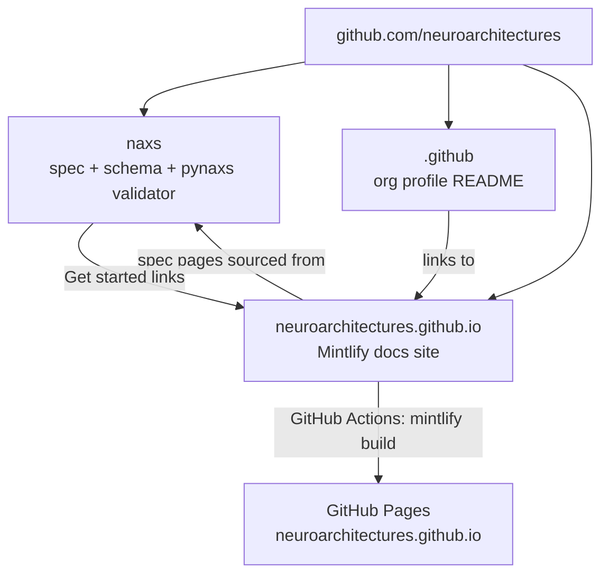

## Product Overview

Build the **github.com/neuroarchitectures** open-source community, modeled on the **agentskills** organization (github.com/agentskills + agentskills.io), centered on the NAXS (Neural Architecture Exchange Specification) standard, consisting of three repos and a docs website served at **https://neuroarchitectures.github.io** (no custom domain for now).

## User Requirements

- **Spec repo** — `neuroarchitectures/naxs`: remote already exists and is pushed; needs cleanup of stale `mirasoth/naxs` references (spec header, example `$schema` URLs), merge of `feat/v1` into `main`, and community files (CONTRIBUTING, issue templates).
- **Org profile repo** — `neuroarchitectures/.github`: profile README mirroring agentskills' style (Intro / Getting Started / Repositories / About).
- **Website repo** — `neuroarchitectures/neuroarchitectures.github.io`: a Mintlify docs site (same framework as agentskills.io) deployed to GitHub Pages via static build in GitHub Actions, since no custom domain is used and Mintlify cloud hosting would not serve the github.io address.
- **Site structure** mirroring agentskills.io: homepage (What is NAXS? / Why NAXS? / How it works / Open development / Get started cards for Quickstart + Specification), Quickstart guide, full Specification pages, Examples gallery, Community/Contribute page, plus a machine-readable `/llms.txt` doc index.

## Tech Stack

- **Website**: Mintlify (MDX-based docs framework, same as agentskills.io) — `docs.json` config, MDX pages, `npx mintlify@latest dev/build`
- **Deployment**: GitHub Actions workflow — checkout → `npx mintlify@latest build` (static export to `mint-out/`) → `actions/upload-pages-artifact` + `actions/deploy-pages`; Pages enabled with "GitHub Actions" source
- **Repos**: git + `gh` CLI (authenticated as caesar0301, verified) for repo creation and settings
- **Spec repo content**: existing Markdown/JSON/Python — no stack changes

## Implementation Approach

1. **Spec repo first** (`/Users/xiamingchen/Workspace/mirasoth/naxs`, remote `origin=git@github.com:neuroarchitectures/naxs.git` already live with `main` at e43bff4 and `feat/v1` at 36e9a29): replace stale `mirasoth/naxs` URLs in `architecture_spec.md` (line 6 Repository header) and in `naxs/v1.0/examples/*.json` `$schema` fields → `neuroarchitectures/naxs`; add CONTRIBUTING.md + `.github/ISSUE_TEMPLATE`; merge `feat/v1` → `main` and push both.
2. **Org profile repo** `neuroarchitectures/.github`: single `profile/README.md` (agentskills-style sections linking the site, spec, and validator). Created at `/Users/xiamingchen/Workspace/mirasoth/dotgithub/.github` (avoid a sibling literally named `.github` being hidden/awkward), pushed via `gh repo create neuroarchitectures/.github --public --source ...`.
3. **Website repo** `neuroarchitectures/neuroarchitectures.github.io` (special name = org root site at `https://neuroarchitectures.github.io/`, so all asset paths must be root-relative `/`, not repo-prefixed): Mintlify scaffold with `docs.json` (nav: Overview / Quickstart / Specification / Examples / Community), homepage MDX reproducing agentskills.io section flow with NAXS content, Specification pages split from the existing `architecture_spec.md`, an Examples gallery rendering the 6 existing example JSONs, and `llms.txt` index.
4. **Mintlify static build verification is the key risk**: Mintlify docs were unreachable during research; at execution start run `npx mintlify@latest dev` locally, then `npx mintlify@latest build` to confirm static output works before wiring CI. If `mintlify build` is unavailable/broken in the environment, fallback is the same site content ported to a plain static generator (e.g. a single-workflow VitePress or handwritten HTML) — same pages, same URLs.
5. **CI/CD**: `.github/workflows/deploy.yml` running on push to `main`: Node 22, `npm i -g mintlify` (or pinned version), `mintlify build`, deploy `mint-out/` via official Pages actions. Enable Pages with `gh api` (`build_type=workflow`). Later, a custom domain can be attached to Mintlify cloud hosting without restructuring content.

## Implementation Notes

- Keep the site content **single-source where possible**: the Specification pages should be generated/split from `architecture_spec.md` (a small script or manual split done once) so the site and spec repo don't silently diverge; link each spec page back to the source file in the naxs repo.
- **Asset path pitfall**: because the repo is `<org>.github.io`, Mintlify's default absolute paths work, but any hardcoded relative links must be root-relative; verify with `mintlify dev --preview` locally.
- **Blast radius**: the naxs repo is public-facing — keep `feat/v1` merge as a clean merge commit (no rebase of shared history), and update `$schema` URLs to point at `main` branch raw URLs so downstream users' documents don't break (raw `mirasoth` URLs may die if the old repo is deleted later).
- **Security**: no secrets in any repo; GitHub Actions uses the built-in `GITHUB_TOKEN` with `permissions: pages: write, id-token: write` only; repos public with Apache-2.0/CC-BY-4.0 consistent with the spec.
- Performance: static Pages deploy, zero backend; Mintlify static output includes client-side search — acceptable size for a docs site.

## Architecture Design

Three-repo community structure mirroring agentskills:



## Directory Structure

```
# 1. Spec repo (existing, modified)
/Users/xiamingchen/Workspace/mirasoth/naxs/
├── architecture_spec.md          # [MODIFY] line 6 Repository URL → neuroarchitectures/naxs
├── README.md                     # [MODIFY] repo links, add website link
├── naxs/v1.0/examples/*.json     # [MODIFY] $schema URLs mirasoth → neuroarchitectures
├── CONTRIBUTING.md               # [NEW] contribution guide (issue/PR/extension process per §11)
└── .github/ISSUE_TEMPLATE/       # [NEW] spec-feedback & operator-registration issue templates

# 2. Org profile repo (new)
/Users/xiamingchen/Workspace/mirasoth/dotgithub/.github/
└── profile/README.md             # [NEW] org profile: what NAXS is, getting started, repositories, about

# 3. Website repo (new)
/Users/xiamingchen/Workspace/mirasoth/neuroarchitectures.github.io/
├── docs.json                     # [NEW] Mintlify config: nav, theme, colors, footer
├── package.json                  # [NEW] devDependency mintlify
├── index.mdx                     # [NEW] homepage: What/Why/How/Open development/Get started cards
├── quickstart.mdx                # [NEW] author first NAXS doc + validate with pynaxs
├── specification/                # [NEW] spec split into MDX pages (concepts, components, params,
│   │                             #      operator registry, block templates, validation, conformance)
│   └── ...mdx
├── examples.mdx                  # [NEW] gallery of the 6 example JSONs with descriptions
├── community.mdx                 # [NEW] contributing, governance, links to GitHub
├── llms.txt                      # [NEW] machine-readable doc index (agentskills.io convention)
└── .github/workflows/deploy.yml  # [NEW] mintlify build → GitHub Pages deploy
```

## Design Approach

A developer-standards docs site in the Mintlify aesthetic (as agentskills.io): clean, technical, content-first. Homepage follows the agentskills.io section flow — "What is NAXS?" with a document-structure code block, "Why NAXS?" as three benefit cards (framework-independent / graph-first / human-readable), "How NAXS works" as a 3-step flow (Author → Validate → Exchange), "Open development" with GitHub links, and a two-card "Get started" CTA (Quickstart / Specification). Inner pages use docs layout with left sidebar nav, sticky top navbar, syntax-highlighted JSON examples. Subtle accent color (neural blue-violet gradient on hero and CTAs), rounded cards with soft borders, and smooth hover transitions on links and cards. Dark-mode friendly code blocks throughout.